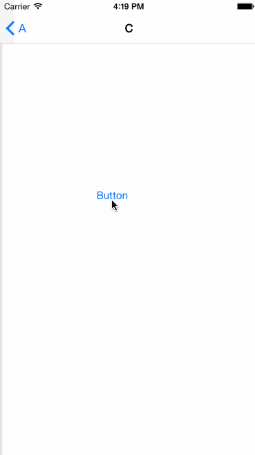

# MFSNavigationController

##### ViewController决定自己是否需要加入NavigationController堆栈，拦截iOS7滑动返回的pop操作，并支持pop操作完成回调。

### 使用方法：
<pre><code>//ViewController内实现&lt;MFSPopActionProtocol&gt;:
- (BOOL)shouldPopActionSkipController; {
    return YES;
}
</code></pre>
pop时，跳过未加入堆栈的ViewController；
 
<pre><code>//MFSNavigationController的属性:
@property (nonatomic, assign) BOOL wantsPopLast;
</code></pre>
最后的ViewController操作失败，需要返回上一个ViewController，nav设置wantsPopLast为YES；

### 兼容性
支持iOS7及以上； 
~~iOS6功能未测试，设置滑动NavigationController类继承MFSNavigationController后，应该能达到相同的效果；~~

#### Demo演示了A、B、C、D 4个页面push后再pop，跳过了A、B、C进入rootViewController；

### update
新增UINavigationController+MFSPopOut，不影响UINavigationController继承

### update2
<pre><code>
//
//  UINavigationController+MFSPopOut.h
//  MFSNavigationController
//
//  Created by maxfong on 15/5/23.
//
//  https://github.com/maxfong/MFSNavigationController
//  使用此库需iOS7及以上，并会强制修改UINavigationController的delegate和interactivePopGestureRecognizer的值，不允许修改

#import <UIKit/UIKit.h>

@interface UINavigationController (MFSPopOut)

/** 强制返回上一个页面，哪怕上一个页面设定shouldPopActionSkipController为YES
    每次push会增加且只是一次的强制返回机会
 */
@property (nonatomic, assign) BOOL wantsPopLast;

@end

@protocol MFSPopActionProtocol <NSObject>

@optional
/** 当前Controller是否需要加入navigationController堆栈，默认NO
 设定YES后，返回和滑动返回（POP）会略过Controller
 提示：rootViewController不能被移除
 不支持childViewController拦截
 */
- (BOOL)shouldPopActionSkipController;

/** 页面执行POP操作后会被调用，可以做一些清理
 不支持方法内使用navigationController执行PUSH、POP等页面切换操作
 支持childViewController调用
 */
- (void)popActionDidFinish;

/** 只拦截滑动返回POP操作并可自定义执行内容，如弹出Alert提示是否返回
 不支持方法内使用navigationController执行PUSH、POP等页面切换操作
 不支持childViewController拦截
 */
- (BOOL)shouldHookDragPopAndAction;

@end

@interface UIViewController (MFSPopAction) <MFSPopActionProtocol>

/** 关闭当前viewController滑动返回
 */
@property (nonatomic, assign) BOOL disableDragBack;

@end

</code></pre>

### update3
<pre><code>
/** 支持滑动返回且底部无页面截图
    开启会默认设置disableDragBack为NO
    关闭会默认设置disableDragBack为YES
    如有需要，设置enableFastDrag后再重新设置disableDragBack
 */
@property (nonatomic, assign) BOOL enableFastDrag;
</code></pre>
